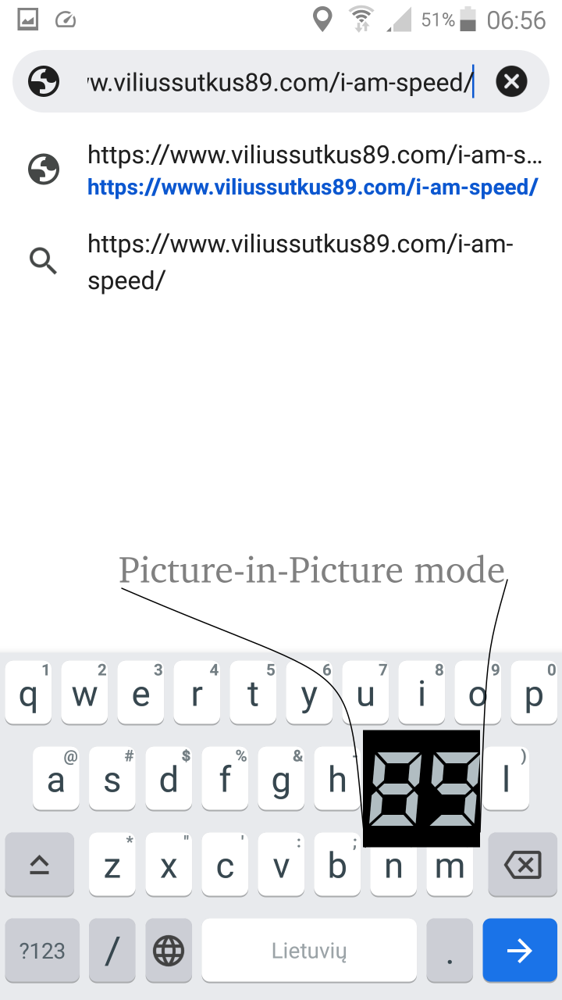

# [I am Speed](https://www.viliusSutkus89.com/i-am-speed)

Android speedometer app with Heads-Up Display and Picture-in-Picture modes

# Screenshots

# Requirements

I am Speed has a reasonable list of requirements for the end user:
* Android 4 (Ice Cream Sandwich, API level 14) or newer.
* 10 Megabytes of storage space.
* GPS receiver.

### Permissions required

List declared in [AndroidManifest.xml](/app/src/main/AndroidManifest.xml):
* android.permission.ACCESS_FINE_LOCATION
* android.permission.ACCESS_COARSE_LOCATION
* android.permission.FOREGROUND_SERVICE
* android.permission.POST_NOTIFICATIONS
* android.permission.SYSTEM_ALERT_WINDOW

Although Android Operating System grants android.permission.INTERNET permission automatically when declared,
this application does not ask for such permission.

ACCESS_FINE_LOCATION and ACCESS_COARSE_LOCATION are needed to obtain speed data from GPS receiver.

The speedometer logic part of I am Speed app is implemented in a foreground service to allow receiving speed updates while the app is not in foreground.
Foreground service requires FOREGROUND_SERVICE permission and POST_NOTIFICATIONS to show foreground notification.

Picture-in-Picture mode requires SYSTEM_ALERT_WINDOW permission.

# Privacy policy

I am Speed does not collect or share any user data.

# Let's Go Digital Font
By WLM Fonts (Wolf Lambert)

https://www.fontsc.com/font/lets-go-digital

# Licence

I am Speed is free software: you can redistribute it and/or modify
it under the terms of the GNU General Public License version 3,
as published by the Free Software Foundation.

This program is distributed in the hope that it will be useful,
but WITHOUT ANY WARRANTY; without even the implied warranty of
MERCHANTABILITY or FITNESS FOR A PARTICULAR PURPOSE.  See the
GNU General Public License for more details.

A copy of the GNU General Public License version 3 is available
at [LICENSE](/LICENSE) and [https://www.gnu.org/licenses/](https://www.gnu.org/licenses/).
